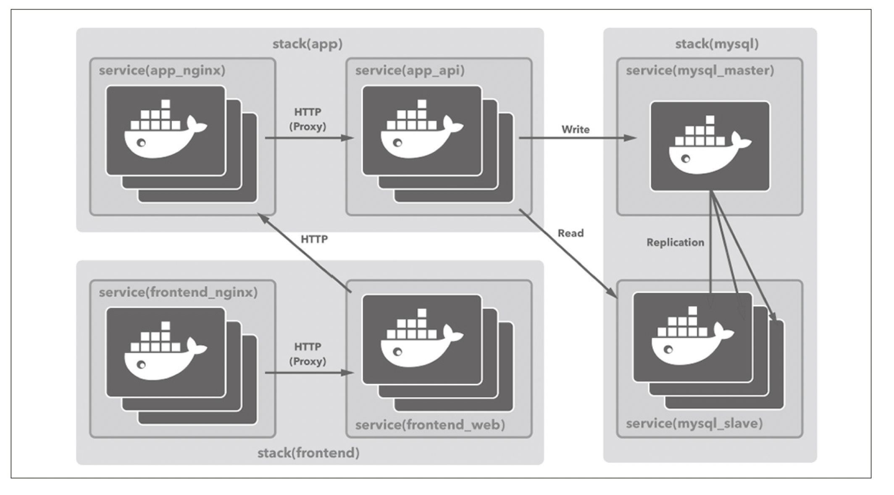
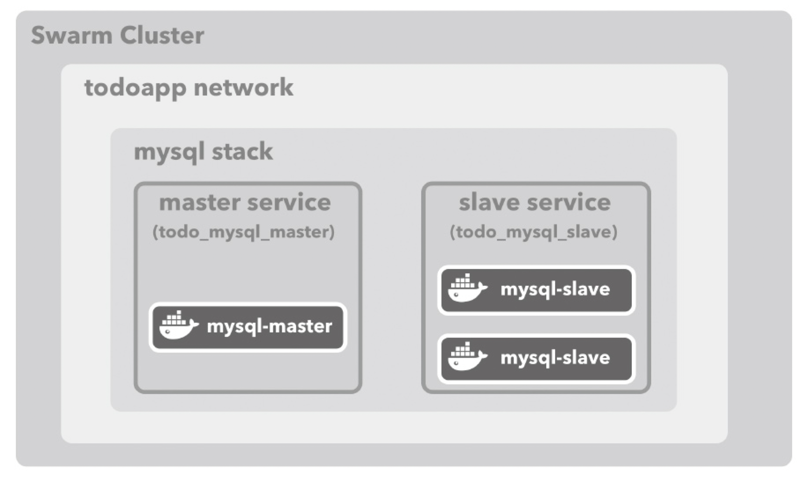

# SwarmTodoApp

Docker Swarm を使って実用的な構成の TODO アプリを作る。

# アプリケーションの仕様

- TODO を登録・更新・削除できる
- 登録されている TODO の一覧を表示できる
- ブラウザから利用できる Web アプリケーションとして構築する
- ブラウザ以外のプラットフォームからでも利用できるように、JSON API のエンドポイントも作成する

# アーキテクチャ



# アーキテクチャの構成要素

| イメージ名 | 用途                                   | Service 名                | Stack 名             |
| ---------- | -------------------------------------- | ------------------------- | -------------------- |
| MySQL      | データストア                           | mysql_master, mysql_slave | MySQL                |
| API        | データストアを操作する API サーバ      | app_api                   | Application          |
| Web        | ビューを生成するアプリケーションサーバ | frontend_web              | Frontend             |
| Nginx      | プロキシサーバ                         | app_nginx, frontend_nginx | Application Frontend |

# 用語

| 名称    | 役割                                                                    | 対応するコマンド |
| ------- | ----------------------------------------------------------------------- | ---------------- |
| Compose | 複数のコンテナを使う Docker アプリケーションの管理 (主にシングルホスト) | `docker-compose` |
| Swarm   | クラスタの構築や管理を担う (主にマルチホスト)                           | `docker swarm`   |
| Service | Swarm で、Service (1 つ以上のコンテナの集まり)を管理する                | `docker service` |
| Stack   | Swarm で、複数の Service をまとめたアプリケーション全体の管理           | `docker stack`   |

# コンテナ配置について

コンテナのオーケストレーションを行う上で複数のホストを用意する必要があるが、導入コストが高い。  
そこで Docker in Docker で「Docker ホストとして機能する Docker コンテナ」を複数立てる。

複数ホストと見なしたコンテナは次の通り。

- registry × 1  
  Docker イメージのレジストリ。  
  あらかじめイメージを push しておき、manager や worker からイメージを pull する。  
  普通は https でアクセスするものだが、http でもアクセスできるような回避策を取る。

- manager × 1  
  Swarm クラスタ全体を制御し、複数実行されている worker へ Service が保持するコンテナを適切に配置する。

- worker × 3  
  複数の worker によってクラスタ全体のアプリケーションを実行する。

# TODO アプリケーション構築の全体像

アプリケーションを構築する流れは次の通り。

1. データストアとなる Master/Slave 構成の MySQL Service の構築

2. MySQL とデータをやり取りするための API を実装

3. Web アプリケーションと API サーバ間にリバースプロキシとなる Nginx を通じてアクセスできるように設定

4. API を利用してサーバサイドレンダリングをする Web アプリケーションを実装

5. フロント側にリバースプロキシ (Nginx) を置く

# 実行

## 事前準備

```bash
# 複数ホストの起動
cd SwarmTodoApp
# docker-compose down --rmi all --volumes
docker-compose up -d

# managerでswarm initを実行してSwarmモードにする (このときswarm joinのトークンが表示されるので控えておく)
docker exec -it manager docker swarm init

# 各workerを登録する
docker exec -it worker01 docker swarm join --token {SWMTKN-1-...} manager:2377
docker exec -it worker02 docker swarm join --token {SWMTKN-1-...} manager:2377
docker exec -it worker03 docker swarm join --token {SWMTKN-1-...} manager:2377

# ノードを確認する (master × 1 と worker × 3 が確認できる)
docker exec -it manager docker node ls

# あらかじめ専用のオーバーレイネットワークを構築する
# オーバーレイネットワークを構築することで、Dockerホストを問わずに配置されているコンテナがあたかも同一NW上に存在するように扱える
docker exec -it manager docker network create --driver=overlay --attachable todoapp
```

## Swarm で MySQL のスタックを構築する

```bash
# ホスト上でMySQLのDockerイメージ(masterとslaveを兼用)をビルドし、registryにプッシュする
cd tododb
docker build -t ch04/tododb:latest .
docker image tag ch04/tododb:latest localhost:5000/ch04/tododb:latest
docker push localhost:5000/ch04/tododb:latest

# Swarm上でMySQLのMaster/Slaveサービスを実行する
docker exec -it manager docker stack deploy -c /stack/todo-mysql.yml todo_mysql
docker exec -it manager docker service ls
```

この時点で Swarm クラスターは以下のようになっている。



## MySQL コンテナに初期データを投入する

```bash
# (確認用)masterコンテナがSwarmのどのノードに配置されているか確認する
docker exec -it manager docker service ps todo_mysql_master --no-trunc --filter "desired-state=running"

# masterのコンテナに入るための情報(コマンドを出力する)
docker exec -it manager docker service ps todo_mysql_master --no-trunc --filter "desired-state=running" --format "docker exec -it {{.Node}} docker exec -it {{.Name}}.{{.ID}} init-data.sh"
>> docker exec -it cda9d8549491 docker exec -it todo_mysql_master.1.va5e3ac7ojcgxari0vvre5jcn init-data.sh

# 上記の出力されたコマンドを実行し、masterで初期データを投入(init-data.sh)する
docker exec -it cda9d8549491 docker exec -it todo_mysql_master.1.va5e3ac7ojcgxari0vvre5jcn init-data.sh

# masterにデータが登録されているか確認する
docker exec -it cda9d8549491 docker exec -it todo_mysql_master.1.va5e3ac7ojcgxari0vvre5jcn mysql -u gihyo -pgihyo tododb
mysql> SELECT * FROM todo LIMIT 1;
mysql> exit

# slaveにもデータが反映されているか確認する
docker exec -it manager docker service ps todo_mysql_slave --no-trunc --filter "desired-state=running" --format "docker exec -it {{.Node}} docker exec -it {{.Name}}.{{.ID}} mysql -u gihyo -pgihyo tododb"

docker exec -it 855397bfcf0c docker exec -it todo_mysql_slave.1.c2gx04w6se8sx5czz6p2ivpvx mysql -u gihyo -pgihyo tododb
mysql> SELECT * FROM todo LIMIT 1;
mysql> exit
```

## API Service の構築 (イメージのビルド)

```bash
# API Serviceのイメージをビルドする
cd SwarmTodoApp/todoapi
docker build -t ch04/todoapi:latest .

# イメージをregistryにpushする
docker image tag ch04/todoapi:latest localhost:5000/ch04/todoapi:latest
docker push localhost:5000/ch04/todoapi:latest
```

## API Service と API Service への Nginx プロキシ の構築

```bash
# Dockerイメージをビルドしてregistryにpushする
cd SwarmTodoApp/todonginx
docker build -t ch04/nginx:latest .
docker tag ch04/nginx:latest localhost:5000/ch04/nginx:latest
docker push localhost:5000/ch04/nginx:latest

# todo_appというStack名でスタックをデプロイする
docker exec -it manager docker stack deploy -c /stack/todo-app.yml todo_app
docker exec -it manager docker service ls

# API Serviceがリクエストを受け付ける(Listen)状態であるか確認する
docker exec -it manager docker service logs -f todo_app_api
> ctrl + c
```

## Web アプリケーションの構築

```bash
# Webアプリのイメージをビルドし、registryにpush
cd SwarmTodoApp/todoweb
docker build -t ch04/todoweb:latest .
docker tag ch04/todoweb:latest localhost:5000/ch04/todoweb:latest
docker push localhost:5000/ch04/todoweb:latest

# todonginxのDockerfile-nginxのイメージをpushする
cd ../todonginx
docker build -f Dockerfile-nuxt -t ch04/nginx-nuxt:latest .
docker tag ch04/nginx-nuxt:latest localhost:5000/ch04/nginx-nuxt:latest
docker push localhost:5000/ch04/nginx-nuxt:latest

# フロントエンドのStackをデプロイする
docker exec -it manager docker stack deploy -c /stack/todo-frontend.yml todo_frontend
docker exec -it manager docker service ls
```

## Ingress で Swarm の外に公開する

```bash
# todo-ingress.ymlをmanagerコンテナでデプロイする
docker exec -it manager docker stack deploy -c /stack/todo-ingress.yml todo_ingress
docker exec -it manager docker service ls
```

## アクセス (動作未確認)

- curl で Web アプリケーションにアクセス

以下のように、レスポンスヘッダーに XPoweredBy:Express が付いているので
nginx から Node.js を経由してレスポンスを返していることがわかる。

```bash
curl -I http://localhost:8000/

HTTP/1.1 200 OK
Server: nginx/1.13.12
Date: Sun,27 May 2018 12:26:01 GMT
ContentType: text/html;charset=utf8
ContentLength: 19403
XPoweredBy: Express
ETag: "4bcbWHCvI+kKJIz6ikNHNPLTZcInfHg"
Vary: AcceptEncoding
```

- curl で静的ファイルにアクセス

静的ファイルを curl で取得する際に X-Powered-By ヘッダーがあれば Node.js に到達しているが、
以下のようにそうなってはいないため Nginx が直接レスポンスを返していることがわかる。

```bash
curl -I http://localhost:8000/_nuxt/app.84213ab389afece29614.js

HTTP/1.1 200 OK
Server:nginx/1.13.12
Date: Sun,27May201812:25:38GMT
ContentType: application/javascript;charset=utf8
ContentLength: 27272
LastModified: Sun,27May 2018 11:38:00 GMT
ETag: "5b0a98986a88"
AcceptRanges: bytes
```

# リソースを全て削除

```bash
cd SwarmToDoApp
# composeで作成したリソースをすべて削除
docker-compose down --rmi all --volumes --remove-orphans

# 今回buildしたイメージをすべて削除
docker images -a | grep "localhost:5000/ch04/" | awk '{print $3}' | xargs docker rmi

# 未使用のvolumeを削除
docker volume prune
```
