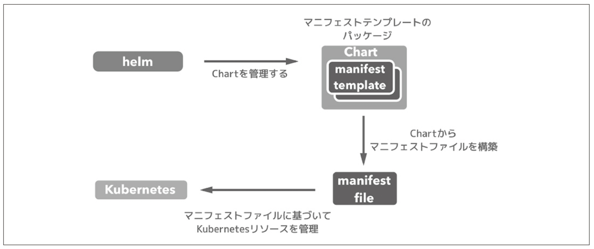
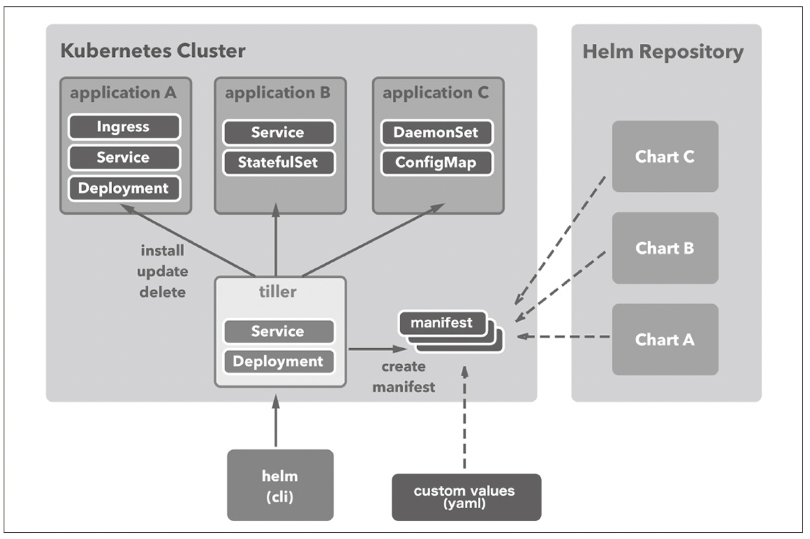

# Helm

# 課題

Kubernetes の運用では、クラスタを 1 つだけ運用するというケースは少ない。  
開発用と本番用でクラスタを分けたり、負荷試験用のクラスタを用意したりと複数のクラスタに同じアプリケーションをデプロイする場面がある。

同じアプリケーションを複数のクラスタにデプロイするときに、**デプロイ先によって環境変数が異なる場合もある**。  
(利用する API が異なる、接続するデータベースが異なる等)  
**クラスタの数だけマニフェストファイルを用意し、環境差異の箇所だけ変えてデプロイするのは大変**である。

このような課題を解決するのが Helm と Chart である。

# Helm と Chart について

Helm は Kubernetes のパッケージ管理ツールであり、Chart は Kubernetes リソース(Service や Pod など)をまとめたパッケージである。

Helm と Chart は[公式](https://github.com/helm/helm)を引用するとで以下のように述べられている。

```
Helm is a tool for managing Kubernetes charts. Charts are packages of pre-configured Kubernetes resources.
```

Helm、Chart、マニフェストファイルマニフェストファイル Kubernetes の関係図は以下となる。



実際の開発では、ローカル・開発・本番環境を問わず、複数環境にデプロイする用途のアプリケーションは Chart でパッケージ化を行い、  
kubectl ではなく**Helm でデプロイやアップデートを完結させる**。  
kubectl はデプロイされたリソースの運用上の修正で利用する。

# Helm のセットアップ

1. helm コマンドのインストール

[参考文献](https://qiita.com/tarosaiba/items/839924d248c4bb7fe2e1)を引用すると、Homebrew からインストールが可能。

```bash
brew install kubernetes-helm

helm version
>> version.BuildInfo{Version:"v3.6.1", GitCommit:"61d8e8c4a6f95540c15c6a65f36a6dd0a45e7a2f", GitTreeState:"dirty", GoVersion:"go1.16.5"}
```

2. ローカル Kubernetes コンテキストに切り替える (不要?)

```bash
kubectl config use-context docker-desktop
```

3. Chart 取得用リポジトリの設定



Helm の概念は上図のようになっており、マニフェストをまとめてパッケージ化したのが Chart である。  
Chart は Helm のリポジトリに`tgz`ファイルとして格納される。  
この Chart を取得するためのリポジトリを設定する必要がある。

```bash
helm repo add stable https://charts.helm.sh/stable
```

Helm リポジトリは種類がいくつか存在する。

| 種類      | 内容                                                                                                                                      |
| --------- | ----------------------------------------------------------------------------------------------------------------------------------------- |
| stable    | 安定した品質を持った Chart が配置されるリポジトリで、セキュアなデフォルト設定値の提供といった一定の技術要件を満たしたものだけが配置される |
| local     | Helm クライアントがインストールされているローカルのリポジトリで、ローカルで作成したパッケージが配置される                                 |
| incubator | stable の技術要件を満たしていない Chart が配置されるリポジトリで、近い将来 stable へ移行されそうなものが配置される                        |

以上で、Helm の初期セットアップは完了

# リポジトリから利用できる Chart を検索する方法

```bash
helm search repo stable
```

# Chart をインストールする

例として、プロジェクト管理ツールである Redmine の Chart をインストールしてみる。
このときユーザー名やパスワードをカスタムのものにするために`redmine.yaml`を用意しておく。

```bash
helm install -f redmine.yaml stable/redmine --generate-name
```

http://localhost にアクセスすると Redmine を利用することができる。  
また、次のようにリリースの一覧を取得できる。

```bash
helm ls

NAME                    NAMESPACE       REVISION        UPDATED                                 STATUS          CHART           APP VERSION
redmine-1624773566      default         1               2021-06-27 14:59:29.603558 +0900 JST    deployed        redmine-14.1.12 4.1.0
```

```bash
kubectl get service,deployment --selector release=redmine-1624773566
```

# Chart でアプリケーションをアンインストールする

Chart を亜人ストールするには、次のようにリリース名を指定する。

```bash
helm delete redmine-1624773566

# release "redmine-1624773566" uninstalled
```
