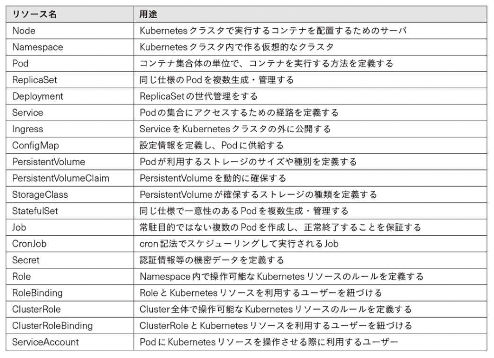
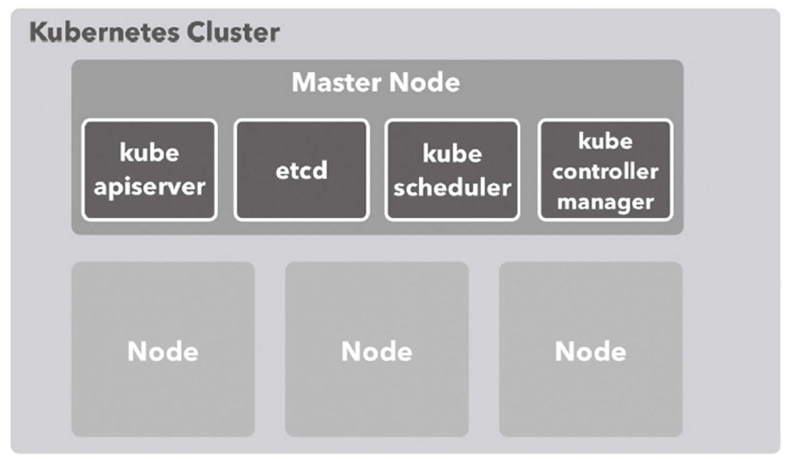
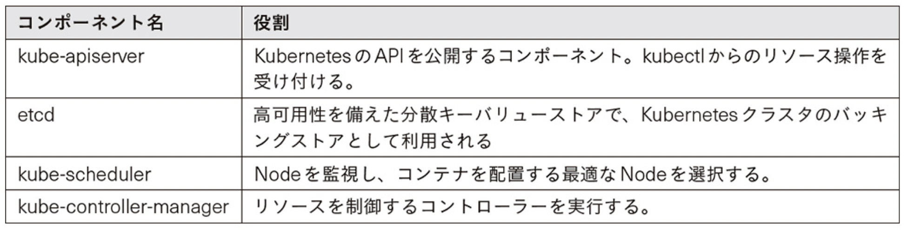
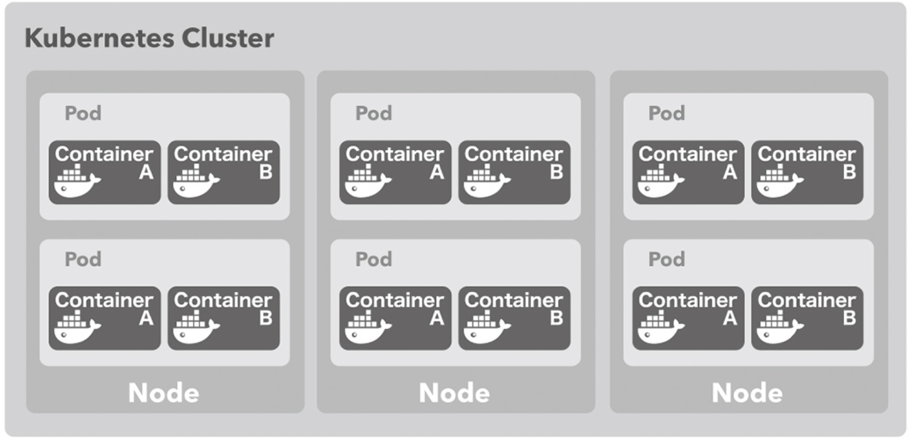

# Kubernetes

Google が先導して開発した、コンテナの運用を自動化するためのコンテナオーケストレーションシステム。

# セットアップ方法

## Kubernetes クラスター

Docker for Mac をインストールし、`Preferences`から Kubernetes を有効化する。

## kubectl コマンド

Homebrew からインストール可能

```bash
brew install kubectl
kubectl version
```

## ダッシュボードツール

Kubernetes にデプロイされているコンテナなどを確認できる Web 管理ツールがあり、
kubernetes の操作に慣れるまでは重宝する。

[参考リポジトリ](https://github.com/kubernetes/dashboard)  
[参考サイト](https://snowsystem.net/container/kubernetes/kubernetes-dashboard-token/)

```bash
# ダッシュボードをデプロイ
kubectl apply -f https://raw.githubusercontent.com/kubernetes/dashboard/v2.3.1/aio/deploy/recommended.yaml

# デプロイの確認 (STATUS が Runningになっている)
kubectl get pod --namespace=kubernetes-dashboard -l k8s-app=kubernetes-dashboard

# secret名を取得
# この例では "deployment-controller-token-xxs5d" がsecret名
kubectl -n kube-system get secret | grep deploy
# >> deployment-controller-token-xxs5d kubernetes.io/service-account-token 3 56m

# secret名からトークンを取得
kubectl -n kube-system describe secret deployment-controller-token-xxs5d

# ブラウザで見れるように、プロキシを起動
kubectl proxy

# プロキシ起動後は以下のURLでダッシュボードを閲覧可能
# http://localhost:8001/api/v1/namespaces/kubernetes-dashboard/services/https:kubernetes-dashboard:/proxy/
```

# Kubernetes の用語

## Node



Node は Kubernetes クラスタの管理下に登録されている Docker ホストのことで、Kubernetes でコンテナをデプロイするために利用される。  
また、Kubernetes クラスタには全体を管理するサーバである Master Node が少なくとも 1 つは配置される。



Master Node を構成する管理コンポーネントは以下の通り。



## Pod

Pod(ポッド)はコンテナの集合体の単位で、少なくとも 1 つのコンテナを持つ。  
Kubernetes では Pod という単位でコンテナを一括りにしてデプロイする。  
(デプロイするコンテナが 1 つだけの場合でも Pod という単位でデプロイされる。)



# Kubernetes のチュートリアル

- [simple-pod](./simple-pod)  
   nginx-proxy と echo アプリケーション ([SwarmTutorial](../SwarmTutorial)と同じ)を Kubernetes にデプロイする。

- [simple-replicaset](./simple-replicaset)  
  同じ仕様の Pod を 複数構成するサンプルである。

- [simple-deployment](./simple-deployment)  
  Deployment は ReplicaSet を管理・操作するためのリソースである。  
  その Deployment のサンプルとなる。

- [simple-service](./simple-service)
  Pod の集合(主に ReplicaSet)に対する経路やサービスディスカバリを提供する Service のサンプルである。

- [ingress](./ingress)
  NodePort は Kubernetes クラスタ外に Service を公開するすることが可能だが、それは L4 層レベルのルーティングとなる。
  HTTP/HTTPS のようにパスベースで転送先を切り替えるという L7 層のルーティングは Ingress を使用することで実現でき、これがそのサンプルである。
