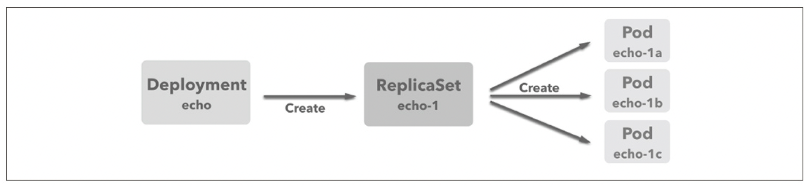

# simple-deployment

Deployment は ReplicaSet を管理・操作するためのリソースである。  
その Deployment のサンプルとなる。

# Deployment とは

ReplicaSet は同一仕様・構成の Pod のレプリカ数を管理・制御するためのリソースであるが、  
**Deployment は ReplicaSet を管理・操作するためのリソース**である。



[simple-deployment.yml](./simple-deployment.yml)と[simple-replicaset.yml](../simple-replicaset/simple-replicaset.yml)を見比べるとわかるが、Deployment の定義は ReplicaSet とあまり違いがない。  
違いは **Deployment が ReplicaSet の世代管理を可能にする点**である。

# デプロイ手順

マニフェストファイルを実行した kubectl コマンドを記録するために--record オプションを指定

```bash
kubectl apply -f simple-deployment.yml --record
```

# 確認

## リソースの確認

Deployment リソースはもちろん、ReplicaSet や Pod が作成されていることも確認できる。

```bash
kubectl get pod,replicaset,deployment --selector app=echo
```

## Deployment のリビジョン確認

Deployment のリビジョンを確認できる。  
初回起動時は`REVISION=1`となっている。

```bash
kubectl rollout history deployment echo
```

# ReplicaSet のライフサイクル

Deployment が管理する ReplicaSet は指定された Pod 数の確保や、新しいバージョンの Pod への入れ替え、以前のバージョンへの Pod へのロールバックといった重要な役割を担う。  
**アプリケーションのデプロイを正しく運用していくためには、Deployment を使うことで ReplicaSet がどのような挙動するのかを t だしく理解しておくことが重要である。**  
以下は、その挙動のポイントをまとめたものである。

## 1. Pod 数のみを更新しても新規 ReplicaSet は生まれない

まずは Pod 数のみを変更する。  
[simple-deployment.yml](./simple-deployment.yml)の replicas を 3 から 4 に変更してみる。

```bash
kubectl apply -f simple-deployment.yml --record
```

次のように、既存の Pod はそのままで新しい 4 つ目のコンテナが作成されている。

```bash
kubectl get pod

echo-84b9c8bb99-dbbt9   2/2     Running   0          15m
echo-84b9c8bb99-pgbzk   2/2     Running   0          15m
echo-84b9c8bb99-qrgj4   2/2     Running   0          15s
echo-84b9c8bb99-rnfmk   2/2     Running   0          15m
```

また、ReplicaSet のリビジョン番号は 1 のままであり、  
**replicas の変更では ReplicaSet の入れ替えは発生しない**ことがわかる。

```bash
kubectl rollout history deployment echo

deployment.apps/echo
REVISION  CHANGE-CAUSE
1         kubectl apply --filename=simple-deployment.yml --record=true
```

## 2. コンテナ定義を更新すると、Deployment のリビジョン番号が上がる

コンテナのイメージを変更してコンテナ定義を更新したときの挙動を確認する。  
以下のように、[simple-deployment.yml](./simple-deployment.yml)の image タグを`patched`に変更してみる。

```yml
- name: echo
  image: gihyodocker/echo:patched
  ports:
    - containerPort: 8080
```

次のように、新しい Pod が作成され、古い Pod が段階的に停止していくことがわかる。

```bash
kubectl apply -f simple-deployment.yml --record
kubectl get pod --selector app=echo

NAME                    READY   STATUS              RESTARTS   AGE
echo-5b47cf4955-2x526   0/2     ContainerCreating   0          8s
echo-5b47cf4955-vztt9   0/2     ContainerCreating   0          8s
echo-84b9c8bb99-dbbt9   2/2     Running             0          22m
echo-84b9c8bb99-pgbzk   2/2     Running             0          22m
echo-84b9c8bb99-qrgj4   2/2     Terminating         0          7m29s
echo-84b9c8bb99-rnfmk   2/2     Running             0          22m
```

Deployment のリビジョンを確認すると、REVISION=2 が作成されている。

```bash
kubectl rollout history deployment echo

deployment.apps/echo
REVISION  CHANGE-CAUSE
1         kubectl apply --filename=simple-deployment.yml --record=true
2         kubectl apply --filename=simple-deployment.yml --record=true
```

## 3. ロールバックを実行する

Deployment のリビジョンが記録されているので、特定のリビジョン内容を確認することができる。

```bash
kubectl rollout history deployment echo --revision=1
```

undo を実行すれば Deployment を直前のリビジョンにロールバックできる。

```bash
kubectl rollout undo deployment echo
```

※ この時リビジョン番号はインクリメントされる模様

# Deployment の削除

マニフェストファイルから Deployment を削除する。  
関連する ReplicaSet や Pod も削除 (Terminate)される。

```bash
kubectl delete -f simple-deployment.yml
kubectl get pod --selector app=echo

NAME                    READY   STATUS        RESTARTS   AGE
echo-84b9c8bb99-gwt4f   2/2     Terminating   0          3m34s
echo-84b9c8bb99-hqcw9   2/2     Terminating   0          3m22s
echo-84b9c8bb99-l75tt   2/2     Terminating   0          3m34s
echo-84b9c8bb99-z85mc   2/2     Terminating   0          3m19s
```
